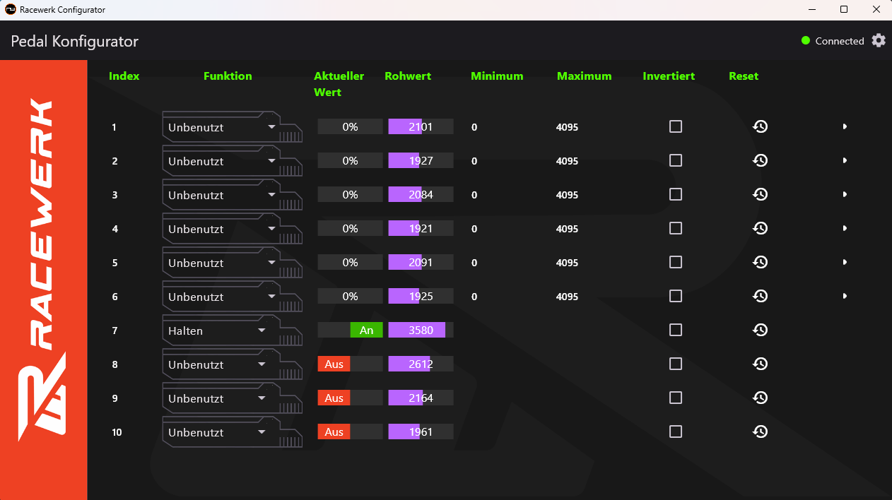
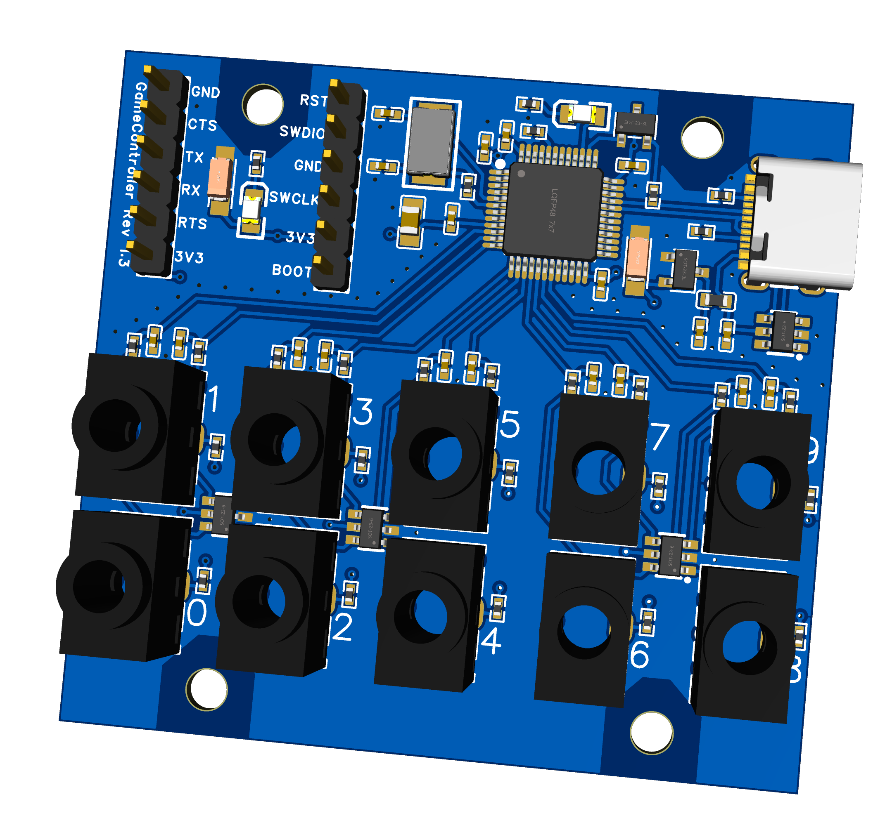

# Get closer Racing Device configurator

This is the configuration Software for the GetCloserRacing pedals. It is fully open source. Feel free to submit pull requests or fiddle with the presets.



It works with the GetCloserRacing Box:



## Development

Contributions are always welcome. Please open an issue before submitting a pull-request to give us a chance to review the need for the feature before you start working on it.

[Setup flutter](https://docs.flutter.dev/get-started/install/windows) and then run

```console
# Run code generator
flutter pub run build_runner build

# Run development tool
flutter run windows
```

## Releasing

Create a new Github tag named v1.1.0 and push it

```console
git tag v1.1.0
git push origin v1.1.0
```
